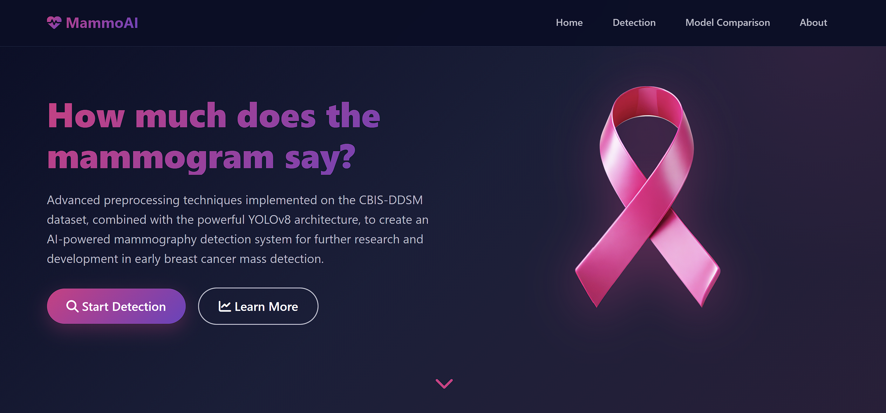
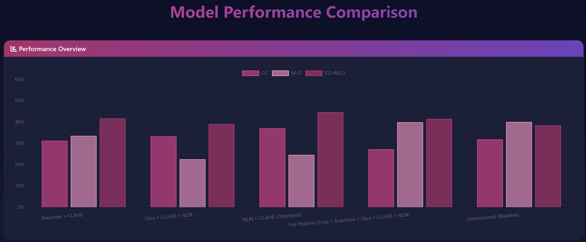
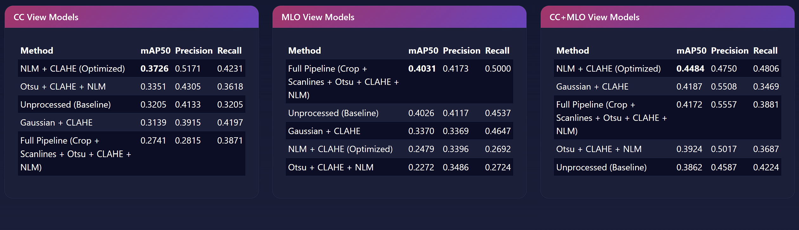
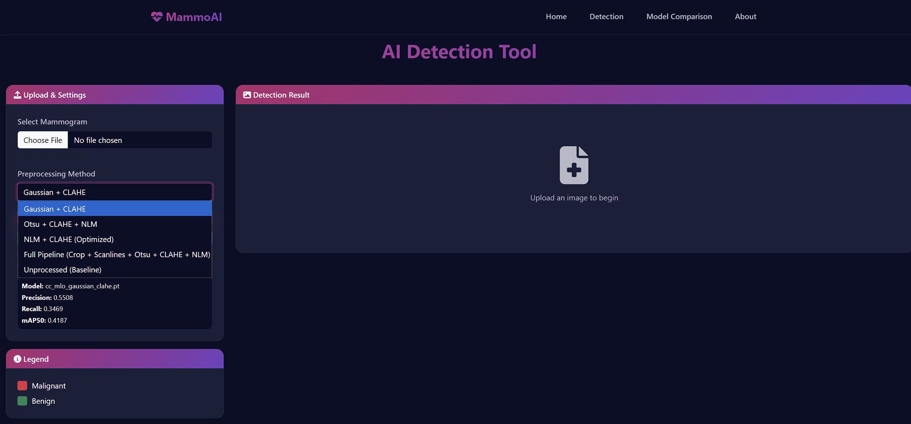
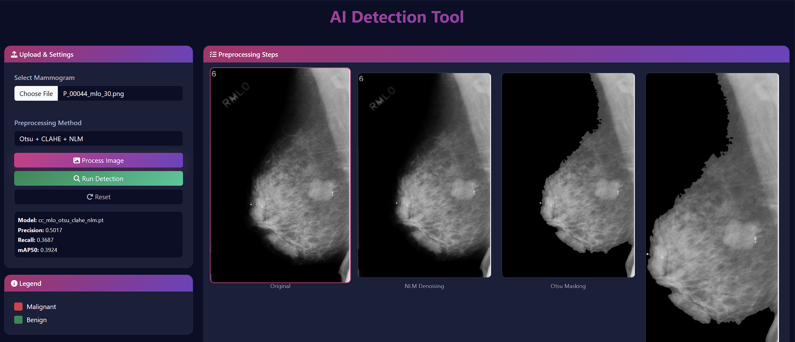
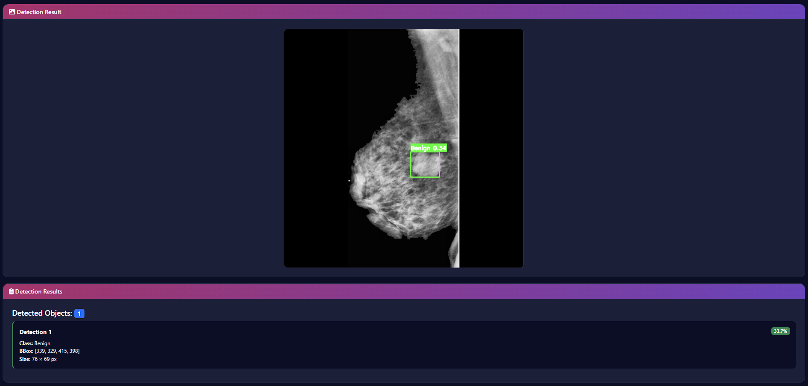
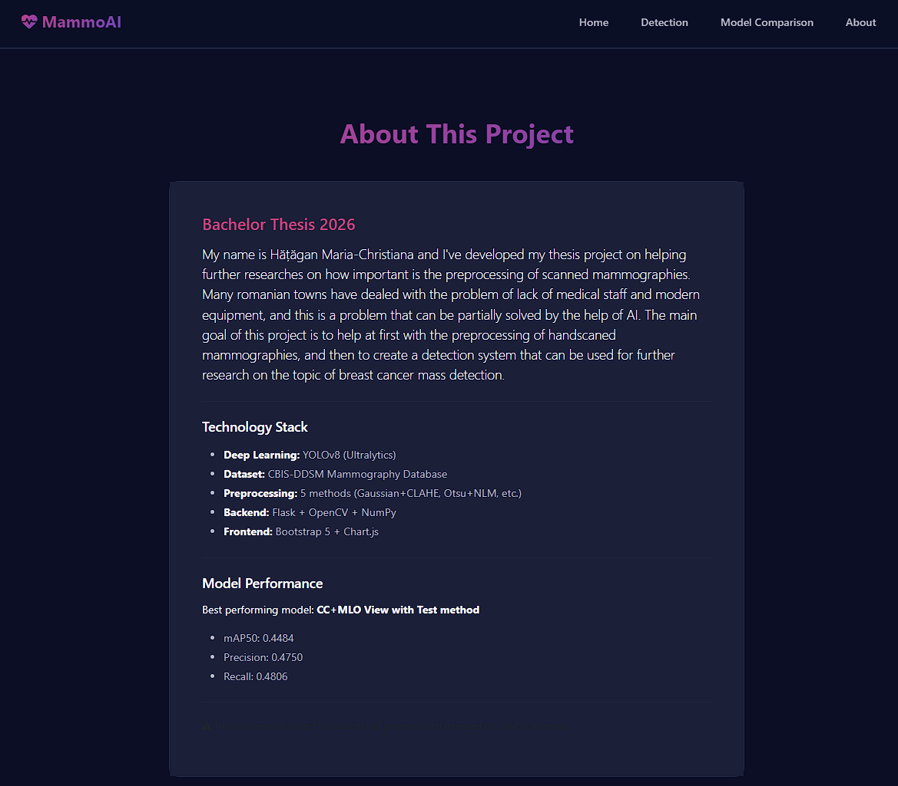

## **Note on Model Files**

Model files (.pt) are not included in this repository due to size constraints.
Link to the models: https://drive.google.com/drive/folders/12xeaiz9CDGlq22AYv2TTlGi_hRhHPtb3?usp=sharing
**After downloading:** Extract and place the `models/` folder in the project root directory.

## **Installation**

\```bash
git clone https://github.com/christianahatagan/Licenta

cd repo

pip install -r requirements.txt
\```

And for running: 
\```
cd app
python app.py\``` 

## **How it looks**

The website is simple and starts with what it does, a button "Start Detection" that scrolls until the part where you can upload an image
to show how it can be processed by my algorithms and "Learn More" for showing some breast cancer statistics.

<p align="center">
  
  <br>
  <em> How the website opens</em>
</p>

If you scroll down, I've attached 3 different associations/campaign which everyone can donate to for the cause of breast cancer in Romania.
The button "Donate" send you directly to their website's form to donate and you can also see there what those assocations/campaign consists
of.

<p align="center">
  
  <br>
  <em> Associations/Campains </em>
</p>

Comparative analysis of all 15 trained models across three mammography views (CC, MLO, CC+MLO) are shown here:

<p align="center">
  
</p>

<p align="center">
  
</p>
The chart displays mAP50 scores for each preprocessing method, with the combined CC+MLO view achieving the highest detection accuracy.

Features include preprocessing method selection, step-by-step visualization, real-time detection with bounding boxes, and automatic model performance display for each of the 5 models.

<p align="center">
  
</p>

Not only you can upload a mamography to be preprocessed as the steps of each of the 5 models, but you can also run a detection to see if the model find one mass or more, of what type and the pixel in the image where it can be found. Don't be scared if there is a mass and the model does not see it. The model has not further been played with to develop a better one because my study was only on how the preprocessing helps a basic model.

<p align="center">
  
</p>
<p align="center">
  
</p>

In the end, there is also an "About" section in which I present my thesis, what I used and my best results. **Thank you!**

<p align="center">
  
</p>
